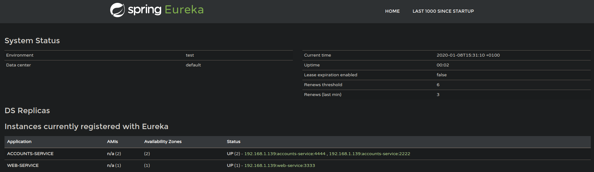

# Lab #6: Microservices
* Julio Salceda - 806420@unizar.es

## 1 & 2. The two microservices are running and registered (two terminals, logs screenshots), The service registration service has the two microservices registered (a third terminal, dashboard screenshots).

* Before showing the two microservices registered, it is important to demonstrate that the registration service is up and running. Ready to allocate these two services:

  * Registration service logs:
  

  * Registration service running in port 1111:
  

* Now that we know that the registration service is running, we proceed to run the **Accounts** and **Web** microservices:

  * Accounts service logs:
  

  * Registration service logs:
  

  * Both microservices registered in the Eureka Server:
  

## A second account microservice is running in the port 4444 and it is registered (a fourth terminal, log screenshots).

* In order to run a second account microservice, a change of port is mandatory. This port change is done by changing the port value in `accounts/application.yml`.

  * Second account service logs:
  

  * Second account service registered in the Eureka Server:
  

## A brief report describing what happens when you kill the microservice with port 2222. Can the web service provide information about the accounts? Why?

* After killing the microservice in port 2222, the Eureka Server gives the following response:

  * Eureka Server response:
  

* However, the accounts data created by the accounts microservice can still be retrieved from the web microservice.
  **Why?**
  Because before terminating the microservice in port 2222, a replica of this microservice was created in port 4444. The server saw this and rerouted the traffic from port 2222 to port 4444.

  * Here is proof that the data can still be retrieved even after terminating the account microservice in port 2222:
  

* As seen in the picture, from port 3333 (which is the web microservice), the data created by the microservice from port 2222 is still accessible due to the replica created in port 4444.
